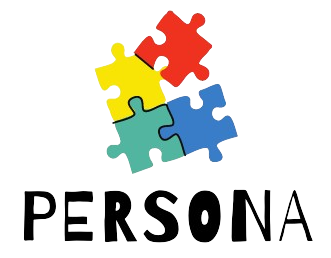
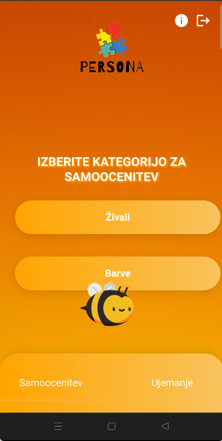
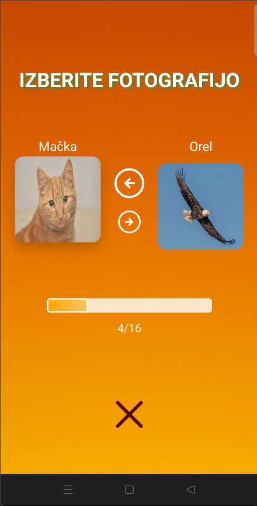

<p align="center">
  
</p>

# Persona

Persona uporabnikom omogoča, da z enostavnim izborom slik intuitivno ocenijo svoje karakteristike ter preverijo združljivost z bližnjimi. Med samoocenjevanjem izberejo sliko, ki najbolje odraža njihovo osebnost, kar zagotavlja globlji vpogled v njihove lastnosti. Isto metodo uporabljamo za ocenjevanje drugih oseb. Ob koncu procesa aplikacija ponudi temeljito analizo in izriše profil združljivosti med ocenjevalcem in ocenjeno osebo, s čimer krepi medosebne odnose.

## Kazalo

- [Pregled Projekta](#pregled-projekta)
- [Pregled Tehnologij](#tehnologije)
- [Funkcionalnosti](#funkcionalnosti)
- [Podatkovna Baza](#podatkovna-baza)
- [Namestitev](#namestitev)
- [Posnetki Zaslona](#posnetki-zaslona)
- [Razvojna Ekipa](#razvojna-ekipa)

## Pregled Projekta

Persona je spletna aplikacija, zasnovana tako, da uporabnikom ponuja edinstven in privlačen način za raziskovanje samoocenjevanja in ujemanja entitet. Uporabniki komunicirajo z različnimi subjekti, kot so živali, tako da izberejo tiste, s katerimi se najbolj identificirajo. Aplikacija ima strukturiran proces samoocenjevanja, ki temelji na različnih kategorijah, kar uporabnikom omogoča vpogled v njihove želje in osebnostne lastnosti.

Po opravljeni samooceni si uporabniki lahko ogledajo podrobne analize, ki poudarjajo njihove prednosti in področja za izboljšave. Poleg tega funkcija ujemanja omogoča uporabnikom, da svoje rezultate primerjajo z drugimi, kar omogoča globlje razumevanje njihove združljivosti z različnimi entitetami.

Funkcije za preverjanje pristnosti, vključno z registracijo in prijavo, zagotavljajo varen dostop in prilagojene izkušnje. Persona Animal je zgrajena z robustnim zaledjem, ki uporablja Firebase, kar zagotavlja zanesljivo shranjevanje podatkov in nemoteno interakcijo. Ne glede na to, ali gre za zabavo ali osebno rast, Persona Animal ponuja nov pristop k samoodkrivanju in povezovanju.

Domača stran: https://persona-animal-ii.onrender.com
...
Koda: https://gitlab.com/Wifeu/persona-animal-ii

Kategorizacija: mobilna aplikacija, spletna aplikacija

Oznake: ZaprtiPodatki, EJS, HTML, Firebase, NodeJS, GitLab, Express, REST, Trello...


Persona omogoča uporabnikom:

- Izbiro entitet (npr. živali) in ogled njihovih podrobnosti.
- Izvajanje samoocenjevanja na podlagi različnih kategorij.
- Ogled in upravljanje zgodovine ujemanj.
- Registracijo in prijavo za upravljanje svojih profilov.

## Tehnologije

| Express.js  | HTML        | Firebase    | JS          | Node.js   |
|-------------|-------------|-------------|-------------|-----------|
|  |  |  |  |  |

## Funkcionalnosti

- **Samoocenitev**: Uporabniki lahko izvajajo samoocenjevanje na podlagi različnih kategorij.
- **Pregled samoocenitve**: Uporabniki lahko pregledajo rezultat samoocenjevanja za različne kategorije
- **Brisanje samoocenitve**: Uporabniki lahko izbrišejo svojo samoocenitev in jo naredijo znova
- **Ocenitev druge osebe**: Uporabniki lahko naredijo ocenitev za druge osebe na podlagi različnih kategorij
- **Pregled zgodovine ujemanja**: Uporabniki lahko pregledajo zgodovino ujemanja
- **Pregled Ujemanj**: Uporabniki lahko pregledajo podrobnosti vsakega ujemanja.
- **Avtentikacija**: Registracija in prijava uporabnikov.
- **Dodajanje novih entitet**: Admin lahko dodaje nove entitet v obstoječe ali nove kategorije
- **Urejanje entitet**: Admin lahko ureja obstoječe entitete
- **Brisanje entitet**: Admin lahko briše obstoječe entitete

## Podatkovna Baza

Projekt Persona uporablja Firebase Firestore za shranjevanje podatkov v različnih zbirkah. Spodaj so primeri JSON struktur iz treh glavnih zbirk:

**Zbirka Uporabnik**

Ta zbirka vsebuje podatke o uporabnikih. Uporabniki tipa 1 so registrirani uporabniki, medtem ko so tipa 2 uporabniki, ki jih dodajo registrirani uporabniki med izračunavanjem ujemanj.

```json
{
  "idUporabnik": 1,
  "email": "mail@mail.com",
  "username": "uporabniskoIme",
  "tip": 1,
  "uid": "uid",
  "Živali": 2 //ocena v kategoriji Živali
}
```
```json
{
  "idUporabnik": 2,
  "ime": "imeUporabnika",
  "ocena_ujemanja": 2,
  "tip": 2,
  "ujemanjeZ": 1, //id uporabnika za katereg gre ujemanje
  "Živali": 1 //ocena v kategoriji Živali
}
```

**Zbirka Eniteta**

Ta zbirka vsebuje podatke o entitetah, skupaj z podatki o ujemanju entitete z drugimi entitetami
```json
{
  "idEntiteta": 1,
  "kategorija": "Živali",
  "naziv": "Bik",
  "negLastnosti": "negativne lastnosti",
  "pozLastnosti": "pozitivne lastnosti",
  "slika": "pot do fotografije",
  "ujemanja": [
    {// id dokumenta ja naziv entitete za katero gre ujemanje
      "ocena_ujemanja": 5
    }
  ]
}
```

**Zborka Odnosi**

Ta zbirka vsebuje podatke o različnih odnosih med uporabniki, glede na oceno ujemanja.

```json
{
  "idOdnos":1,
  "opis": "Opis odnosa za oceno ujemanja 1"
}
```

## Namestitev

Za lokalno poganjanje projekta sledite tem korakom:

1. **Klonirajte repozitorij**:

   ```bash
   git clone https://gitlab.com/Wifeu/persona-animal-ii
   cd persona-animal-ii
   ```

2. **Namestite odvisnosti**:

   ```bash
   npm install
   ```

3. **Zaženite strežnik**:

   ```bash
   node index.js
   ```

4. **Odprite brskalnik** in navigirajte na `https://persona-animal-ii.onrender.com`.

## Posnetki Zaslona

<table>
  <tr>
    <td></td>
    <td></td>
  </tr>
</table>


## Razvojna Ekipa

Kosta Jovanovic
Lejla Sukanovic
Katarina Srdanov


Leto izdelave: 2024

